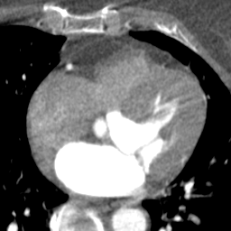

# TT-U-Net: Temporal Transformer U-Net for motion artifact reduction in dynamic cardiac CT

Ziheng Deng, School of BME, Shanghai Jiao Tong University

This repository is the official implementation of TT-U-Net: Temporal Transformer U-Net for motion artifact reduction in dynamic cardiac CT. In this paper, we introduce a novel framework for motion artifact reduction in dynamic cardiac CT imaging. Two main contributions of the paper are:

* We propose a simulated motion-perturbed cardiac CT dataset. The dataset provides paired training samples (image with and without motion artifacts) and is with realistic appearance.

* We propose a novel temporal transformer U-Net (TT U-Net) for motion artifact reduction. We handle this challenging problem as a video deblurring task and modify the vanilla U-Net by introducing self-attention mechanism along temporal dimension.

## Demo
|Case|Case1|Case2|Case3|

|Uncorrected||||

|TT U-Net Corrected||||

