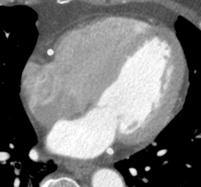

# [WIP] TT U-Net: Temporal Transformer U-Net for motion artifact reduction in dynamic cardiac CT

Author: Ziheng Deng, School of BME, Shanghai Jiao Tong University

This repository is the official implementation of TT U-Net: Temporal Transformer U-Net for motion artifact reduction in dynamic cardiac CT. In this paper, we introduce a novel framework for motion artifact reduction in dynamic cardiac CT imaging. Two main contributions of the paper are:

* We propose a simulated motion-perturbed cardiac CT dataset. The dataset provides paired training samples (images with and without motion artifacts) which are __*dynamic*__ and __*realistic*__.

* We propose a novel temporal transformer U-Net (TT U-Net) for motion artifact reduction. We consider this challenging problem as a video deblurring task and modify the vanilla U-Net by introducing a self-attention mechanism along the temporal dimension. We achieve __*whole heart*__ motion artifact reduction in __*dynamic*__ cardiac CT images.

## Demo

Here are some examples of our motion artifact reduction algorithm tested on __*real clinical CT scans*__. TT U-Net restores the CT images in a post-processing way, which is effective and efficient.

|           Case            |                  Case1                   |                   Case2                   |                  Case3                   |
| :-----------------------: | :--------------------------------------: | :---------------------------------------: | :--------------------------------------: |
|    Uncorrected images     |  |  |  |
| TT U-Net corrected images |    |    |    |

## Contents

* [[WIP]Simulated motion-perturbed cardiac CT dataset](#Simulated)
* [[WIP]TT U-Net](#TT)

Simulated motion-perturbed cardiac CT dataset

The code (Matlab implementation) will be available after the paper is published.

It is still a challenge to image the moving heart with cardiac CT. The typical heart period is ~800ms (75 bpm), whereas the temporal resolution of the most advanced CT system is ~130ms. Thus motion artifacts are inevitable. 

The shape of motion artifact is complicated, which depends on both the individual anatomy structure and the scanning process. It is preferable to simulate the motion artifacts based on the CT imaging model. Specifically, we can simulate a CT scan by computing the cone beam projection of a __dynamic__ volume. The projection data collecting from different views actually record 2D projections of a __time-varying__ object, thus it introduce spatiotemporal ambiguity and lead to motion artifacts.

Here is an example:

|            Ground truth image            |     Simulated motion-perturbed image      |
| :--------------------------------------: | :---------------------------------------: |
|  |  |
|  |  |

However, the ground truth image, or let's say the dynamic cardiac CT image with few motion artifacts is medically unattainable (that's why we need motion artifact reduction algorithms). Alternatively, we here propose a method to synthesize such ground truth images first.

We want the GT images be ① __dynamic__ and ② __realistic-looking__. The reason for the latter aspect is that we want to train a motion artifact reduction model that can works on clinical images. Here are the ingredients we involved:

* [XCAT Phantom](https://aapm.onlinelibrary.wiley.com/doi/abs/10.1118/1.3480985), which is a 4D digital phantom for medical imaging study. It is __*dynamic*__ but is __*not*__ __*with*__ __*realistic*__ __*appearance*__. 
* Single phase clinical cardiac CT image with few motion artifacts. It is __*static*__ but __*realistic*__.

|       Ingredient 1: XCAT Phantom        |          Ingredient 2: Single-phase CT           |
| :-------------------------------------: | :----------------------------------------------: |
|  |  |

The main idea is to generate a dynamic deformation field and then we can warp the single-phase CT images to any cardiac phase. The XCAT Phantom is used to build a cardiac motion model in the form of 4D statistical motion model (4D SSM). Then, Personalized deformation field is obtained for each single-phase CT image.

Though we have no permission to share the [XCAT phantom](https://aapm.onlinelibrary.wiley.com/doi/abs/10.1118/1.3480985), we believe most of the readers do have the access to all the two ingredients we need. Also, if ''dynamic cardiac CT images with few motion'' are available, one may also refer our method and achieve data augmentation of your dataset. 

As for the single-phase clinical cardiac images, there exist some public datasets. In clinical routine, the ECG-gated strategy is widely adopted to perform CT scan at quiescent cardiac phase. Therefore, it is possible to acquire single-phase cardiac CT images with few motion artifacts. We here recommend the [MMWHS dataset](http://www.sdspeople.fudan.edu.cn/zhuangxiahai/0/mmwhs/) proposed by Professor Zhuang at Fudan University. This dataset provides single-phase cardiac CT images with segmentation labels which are very useful for implementing our method.

Note that the scale of the simulated dataset depends on  __*the number of single-phase clinical cardiac CT images you have*__.  

### Workflow

We expect the dataset to be both __*dynamic*__ and __*realistic*__. Intuitively, it is achieved by animating a single-phase cardiac CT image with a single-phase clinical cardiac CT image with a patient-specific motion model. 

#### Step 1: Build a 4D SSM using XCAT phantoms

We follow [Perperidis's method](https://link.springer.com/chapter/10.1007/11566489_50) to build the 4D SSM. Please refer to the origin paper or our paper for detailed description. Similar methods are also used in [Metz's](https://ieeexplore.ieee.org/abstract/document/6170565/), [Wilms's](https://link.springer.com/chapter/10.1007/978-3-642-33418-4_43), [Unberath's](https://ieeexplore.ieee.org/abstract/document/7163978) works. 

We used 21 4D XCAT phantoms to train the 4D SSM. Each 4D XCAT phantom involves a series of 20 frames that cover a whole cardiac cycle. The phantoms were firstly turned into surface shape models represented by surface landmarks (or say in the form of point distribution model). For example:

After that, all the shape models are spatially aligned and 4D SSM is built by performing PCA on all the point distribution models.

$$s^{i,j}_{XCAT}(b^i_{anatomy},b^{i,j}_{motion})=\overline{s}+P_{anatomy}b^i_{anatomy}+P_{motion}b^i_{motion},$$

where the left side is the shape model parameterized by the anatomy weight and the motion weight. The second term on the right side describes the inter-subject variation, namely, different people have different heart shapes. The third term on the right side described the inter-phase variation, namely, the shape deformation induced by cardiac motion. The third term is what we mostly desire.

#### Step 2: Predict the dynamic shape model of a single-phase clinical cardiac CT image

The XCAT phantom provides both the phantom images and the segmentation labels. Thus, we can easily use the segmentation labels to determine the dynamic shape model. Fortunately, The [MMWHS dataset](http://www.sdspeople.fudan.edu.cn/zhuangxiahai/0/mmwhs/) also provides the segmentation labels for some of the single-phase clinical images. (For those that are absent of segmentation labels, we have to do it by ourselves).  We thereafter turn the segmentation map of the single-phase clinical image to a static shape model in the form of a point distribution model in the common space. The dynamic shape model can be predicted by 

$$s^{j}_{PAD}=s_{clinical}+P_{motion}\overline{b^j_{motion}}.$$

Intuitively, we use the motion information from 4D SSM to let the heart "beat again". The average motion is added in the common space, and then we transform the dynamic shape model to the origin space.

#### Step 3: From dynamic shape model to dynamic cardiac CT images

So far we have obtained the predicted dynamic shape model of the single-phase clinical cardiac CT image. However, it only describes the surface shape of a moving heart. We here use a ShapeMorph model to predict a dense deformation model from the dynamic shape model. It is basically a modified [VoxelMorph](https://ieeexplore.ieee.org/abstract/document/8633930) model. Instead of taking two images as the input, it takes two segmentation maps as the input. The ShapeMorph model was trained on XCAT dataset. The training and inference process is as below.

With the dense deformation model, we can obtain dynamic CT images by warping the original single-phase cardiac CT image.

#### Step 4: Simulation of motion-perturbed cardiac CT images

With the synthesized dynamic cardiac CT images, motion-perturbed images can be obtained by computer simulation of a clinical cardiac CT scan. Various realistic images with motion artifacts can be obtained by adjust parameters including heart rate, initial scan angle, reconstruction phase, and so on. Please refer to the [example](#Simulated) at the beginning of this section.

## TT U-Net

The code (Pytorch implementation) will be available after the paper is published.

