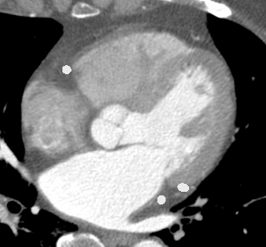

# [WIP] TT U-Net: Temporal Transformer U-Net for motion artifact reduction in dynamic cardiac CT

Ziheng Deng, School of BME, Shanghai Jiao Tong University

This repository is the official implementation of TT U-Net: Temporal Transformer U-Net for motion artifact reduction in dynamic cardiac CT. In this paper, we introduce a novel framework for motion artifact reduction in dynamic cardiac CT imaging. Two main contributions of the paper are:

* We propose a simulated motion-perturbed cardiac CT dataset. The dataset provides paired training samples (image with and without motion artifacts) and is with realistic appearance.

* We propose a novel temporal transformer U-Net (TT U-Net) for motion artifact reduction. We handle this challenging problem as a video deblurring task and modify the vanilla U-Net by introducing self-attention mechanism along temporal dimension.

## Demo

Here are some examples of our motion artifact reduction algorithm tested on real clinical CT scans. TT U-Net restores the CT images in a post-processing way, which is effective and efficient.

|           Case            |                  Case1                   |                  Case2                   |                   Case3                   |
| :-----------------------: | :--------------------------------------: | :--------------------------------------: | :---------------------------------------: |
|    Uncorrected images     |  |  |  |
| TT U-Net corrected images |    |    |    |

## Contents

* [Simulated motion-perturbed cardiac CT dataset](#Simulated motion-perturbed cardiac CT dataset)
* [TT U-Net](#TT U-Net)

## Simulated motion-perturbed cardiac CT dataset

It is still a challenge to image the moving heart with cardiac CT. The typical heart period is ~800ms (75 bpm), whereas the temporal resolution of the most advanced CT system is ~130ms. Thus motion artifacts are inevitable. 

The shape of motion artifact is complicated, which depends on both the individual anatomy structure and the scanning process. It is preferable to simulate the motion artifacts based on the CT imaging model. Specifically, we can simulate a CT scan by computing the cone beam projection of a __dynamic__ volume. The projection data collecting from different views actually record 2D projections of a __time-varying__ object, thus it introduce spatiotemporal ambiguity and lead to motion artifacts.

Here is an example:

| Ground truth image                       | Simulated motion-perturbed image          |
| ---------------------------------------- | ----------------------------------------- |
|  |  |
|  |  |

However, the ground truth image, or let's say the dynamic cardiac CT image with few motion artifacts is medically unattainable (that's why we need motion artifact reduction algorithms). Alternatively, we here propose a method to synthesize such ground truth images first.

We want the GT images be ① __dynamic__ and ② __realistic-looking__. The reason for the latter aspect is that we want to train a motion artifact reduction model that can works on clinical images. Here are the ingredients we involved:

* [XCAT Phantom]((https://aapm.onlinelibrary.wiley.com/doi/abs/10.1118/1.3480985)), which is a 4D digital phantom for medical imaging study. It is __dynamic__ but is __not__ __with__ __realistic__ __appearance__. 
* Single phase clinical cardiac CT image with few motion artifacts. It is __static__ but __realistic-looking__.

| Ingredient 1: XCAT Phantom              | Ingredient 2: Single-phase CT                    |
| --------------------------------------- | ------------------------------------------------ |
|  |  |

The main idea is to generate a dynamic deformation field and then we can warp the single-phase CT images to any cardiac phase. The XCAT Phantom is used to build a cardiac motion model in the form of 4D statistical motion model (4D SSM). Then, Personalized deformation field is obtained for each single-phase CT image.

We have no permission to share the [XCAT phantom]((https://aapm.onlinelibrary.wiley.com/doi/abs/10.1118/1.3480985)), but we believe most of the researchers focus on the study of dynamic CT imaging will have the access. Also, if ''dynamic cardiac CT images with few motion'' are available, one may also refer our method and achieve data augmentation of your dataset. As for the single-phase clinical cardiac images, we believe there exist some public datasets. In clinical routine, the ECG-gated strategy is widely adopted to perform CT scan at quiescent cardiac phase. Therefore, it is possible to acquire single-phase cardiac CT images with few motion artifacts. We here recommend the [MMWHS dataset](http://www.sdspeople.fudan.edu.cn/zhuangxiahai/0/mmwhs/) proposed by Professor Zhuang at Fudan University. This dataset provides single-phase cardiac CT images with segmentation labels (which is useful for implement our method).

Though we are not able to directly share our motion-perturbed cardiac CT dataset (the IP issue), we believe most of the readers will have the access to all the ingredients we need.

### Flowchart

